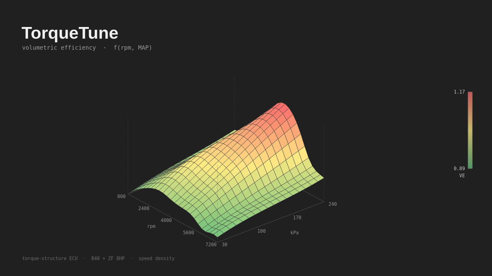

# Open Powertrain Controller (working title)

A standalone engine management system for **modern** engines, with
**transmission control as a first-class part of the architecture** rather than a
bolt-on.

Status: **architecture / pre-hardware.** Nothing here is built yet. These
documents exist to make the expensive decisions before any PCBs are ordered.

## Thesis

The aftermarket is well served at the "run an old port-injected engine" end and
at the "$8k professional motorsport ECU" end. The gap is a controller that
handles what a 2015+ factory engine actually does — direct injection, variable
lift, drive-by-wire, electric boost and thermal actuators, CAN-FD body
integration — *and* controls the automatic transmission bolted to it, with the
engine and transmission sharing one coordinated torque model.

That last clause is the whole product. See
[docs/architecture.md](docs/architecture.md#why-torque-structure-first).

## The one decision everything else depends on

Build the control strategy in the **torque domain**, not the load-table domain.

Pedal position becomes a *torque request*. Every other subsystem that wants to
influence the engine — shift control, traction control, cruise, idle, limp
modes — becomes another *torque requestor*. An arbitration layer resolves them
into a single coordinated target, which is only then converted into air, fuel
and spark setpoints.

This is how OEMs do it. The transmission's request for a torque cut during the
inertia phase of a shift is not a special case — it is just another requestor,
arbitrated with correct authority limits and ramp rates.

**Calibrated claim:** this is not required to ship. MaxxECU controls a ZF8HP
well from a conventional VE-table architecture with a single-scalar torque
estimate. What the structure buys is an estimate that stays honest when spark is
retarded or cams have moved, and an *available authority* signal a load-table
design cannot populate. That is a robustness edge, not a capability nobody else
has. See
[transmission-control.md](docs/transmission-control.md#what-integration-actually-buys).

## Document map

| Document | Covers |
|---|---|
| [docs/architecture.md](docs/architecture.md) | Torque structure, module split, CAN backbone, safety concept |
| [docs/transmission-control.md](docs/transmission-control.md) | Supervisor vs. direct mechatronic control, what shift control actually requires |
| [docs/hardware.md](docs/hardware.md) | MCU selection, GDI power stage, I/O budget, per-module sketches |
| [docs/roadmap.md](docs/roadmap.md) | Staged milestones with exit criteria |

## Running the tuner application



```bash
pip install -e .            # once; installs PySide6, pyqtgraph, numpy, matplotlib
python -m tuner --demo      # start connected to the demo ECU
```

For engine sound: `pip install sounddevice`, then tick **Engine sound** in the
Simulator dock. It is synthesized from the live channels (firing pulses at
rpm/30 Hz, exhaust resonance, turbo whistle, a bang and drop-out on a shift
cut), not a recording of any particular engine. A recorded sample bank can
replace it behind `EngineSynth.render()`.

Windows executable: run `packaging\build.bat` from the repo root, then
`dist\TorqueTune\TorqueTune.exe`. The application is at Phase 3 of
[docs/tuning-app-plan.md](docs/tuning-app-plan.md): heat-map table editor
with live cursor and full keyboard editing, axis editing, software-rendered
3D surface, gauges, live datalog with recording, tune load/save and burn,
and a **simulated engine and ZF 8HP driveline** driven by a virtual pedal in
road or dyno mode. **Simulator → Live Powertrain** opens the SCADA-style
mimic diagram: a cylinder cutaway running the cycle in slow motion with spark
timing and mixture, and the 8HP with its five shift elements filling with
pressure. The shift coordinator exercise in `tools/shift/` runs inside the
simulator on every shift. The torque pages follow in Phase 4.

## Reference target

First integration target is a **BMW B48 + ZF8HP in a GR86/ZN6 chassis** — the
build that prompted this project. It is a good forcing function: direct
injection, Valvetronic, DBW, electric wastegate, and a factory-paired 8-speed
automatic whose mechatronic unit speaks CAN. If the platform can run that, it
can run most of the 2015+ field.

## Scope warning

This is a multi-year project that spans embedded firmware, power electronics,
control theory, and protocol reverse engineering. The roadmap is staged so that
each phase produces something independently useful and testable, and so the
reference car is driving on its factory DME the entire time rather than sitting
on jackstands waiting for the platform to mature.

## Learning to use it

`docs/course/` is TQ-101, a fifteen session course on engine
calibration built around this application: four parts on combustion,
the control problem, calibration practice and integration, with six
labs marked inside the app against the simulator's hidden plant.

Open **TQ-101 Course** in the navigator, press **Load the course
tune**, and press **Mark everything** to see where you stand.

## Cover art and icon

The header image, the About-box splash and the Windows icon are rendered by
[tools/make_cover.py](tools/make_cover.py) from the same projection the 3D
view uses and the same VE truth surface the simulator calibrates against, so
the picture cannot drift away from the model behind it. Regenerate with
`python tools/make_cover.py` rather than editing the PNGs.

## Firmware

`fw/` holds the C that runs the engine: crank and cam decoder,
angle-domain event scheduler, the torque model ported from `tqmodel` and
cross-checked against it, the fuel and pump path, the Level 2 monitor,
and the tuner link protocol. It builds for the host so the whole control
path is tested in CI without hardware.

```
cmake -S fw -B build/fw && cmake --build build/fw && ctest --test-dir build/fw
```

The target HAL is not written. The trigger numbers are placeholders
until the real engine is scoped. See `docs/ultracode-plan.md` for the
gates that must pass before first key-on.
